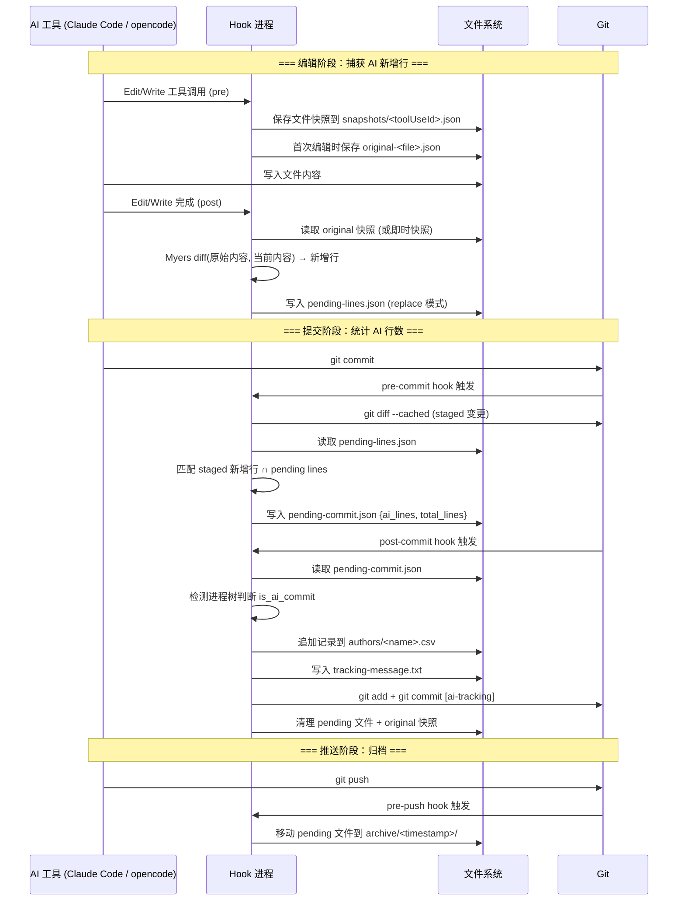

# AI Code Tracker

通过 git hooks 和 AI 工具钩子自动追踪每次 commit 中 AI 生成的代码行数。

## 工作原理

### 整体流程



1. AI 工具（opencode / Claude Code）编辑文件前，hook 捕获文件内容快照
2. 编辑完成后，hook 将文件新内容与快照做 diff，计算出 AI 新增的行
3. 新增行记录到 `.ai-tracking/pending-lines.json`
4. `git commit` 时，pre-commit hook 将 pending lines 与 staged diff 匹配，生成统计
5. post-commit hook 将统计数据写入 CSV，并创建一条 `[ai-tracking]` 追踪提交

### Snapshot（快照）

快照是每次编辑文件**之前**捕获的文件内容副本，用于和编辑后的内容做 diff，计算 AI 新增了哪些行。

存储位置：`.ai-tracking/snapshots/`

有两种快照：

- **即时快照**（`<toolUseId>.json`）：每次编辑都重新捕获，post-hook 完成后删除
- **原始快照**（`original-<filename>.json`）：只在文件第一次被编辑时创建，跨多次编辑保留

原始快照的作用：当 AI 对同一个文件多次编辑时，diff 始终从第一次编辑前的基线开始计算，避免中间编辑产生的残留行被重复统计。在 post-commit 时自动清理。

### 支持的 AI 工具

| 工具 | 追踪方式 |
|------|---------|
| opencode | 插件系统（`tool.execute.before/after` 事件，内存中的 Map） |
| Claude Code | Git hooks（每次工具调用启动独立进程，文件系统快照） |

## 安装

```bash
node install-to-project.js /path/to/your/project
```

安装后会在目标项目中配置 git hooks 和 AI 工具钩子。

## 配置

安装后自动生成 `.ai-tracking/config.json`（不提交到代码仓，仅本地使用）：

```json
{
  "enabled": true,
  "count_blank_lines": false,
  "tracking_commit_suffix": "[ai-tracking]",
  "auto_tracking_commit": true
}
```

| 配置项 | 类型 | 默认值 | 说明 |
|--------|------|--------|------|
| `enabled` | boolean | `true` | 设为 `false` 完全关闭追踪（hook 入口、git hooks 全部跳过） |
| `count_blank_lines` | boolean | `false` | 是否将空行计入 total_lines |
| `tracking_commit_suffix` | string | `"[ai-tracking]"` | 追踪 commit message 的后缀标记，也用于检测跳过已有追踪 commit |
| `auto_tracking_commit` | boolean | `true` | 设为 `false` 时不单独生成 `[ai-tracking]` commit，改为 amend CSV 进原始 commit |

以下目录始终忽略，不可配置：`.ai-tracking/`、`.git/`、`node_modules/`、`dist/`、`build/`

## 数据存储

所有追踪数据存储在项目的 `.ai-tracking/` 目录中：

```
.ai-tracking/
├── config.json              # 配置（enabled, ignore, count_blank_lines）
├── pending-lines.json       # 待匹配的 AI 新增行
├── pending-commit.json      # pre-commit 生成的统计（post-commit 消费）
├── tracking-message.txt     # 追踪提交的 commit message
├── plugin.log               # 运行日志（所有 hook 和安装操作的记录）
├── snapshots/               # 快照文件
├── authors/                 # 按作者分组的 CSV 统计
└── archive/                 # pre-push 归档的文件
```

## 日志排查

所有 hook 和安装操作的日志写入 `.ai-tracking/plugin.log`，自动轮转（单文件最大 5MB，保留 3 个归档）。

### 日志格式

```
[时间戳(UTC)] [级别] [事件来源] 描述 {JSON附加信息}
```

示例：

```
[2026-05-14T15:03:11.921Z] [INFO] [commit-stats.pre-commit] enter
[2026-05-14T15:03:11.945Z] [INFO] [pre-commit] complete {"stagedFiles":23,"totalAddedLines":1288,"aiLines":0,"isAiCommit":true,"durationMs":17}
[2026-05-14T15:03:11.994Z] [INFO] [post-commit] processing commit {"subject":"fix: xxx","aiLines":3,"totalLines":4}
[2026-05-14T16:33:45.691Z] [INFO] [claude-code.pre] captured snapshot {"file":"test.js"}
[2026-05-14T16:33:54.272Z] [INFO] [claude-code.post] recorded added lines {"file":"test.js","addedLines":5}
```

### 常见事件来源

| 事件 | 含义 |
|------|------|
| `claude-code.pre` / `claude-code.post` | Claude Code 工具调用的前后 hook |
| `claude-code.bash-pre` / `claude-code.bash-post` | Bash 命令执行的前后 hook |
| `pre-commit` / `post-commit` / `pre-push` | Git hooks 触发的统计流程 |
| `install` / `install.check` / `install.repair` | 安装/检查/修复操作 |
| `plugin.init` | opencode 插件初始化 |

### 排查方法

```bash
# 查看最近的 hook 活动
tail -20 .ai-tracking/plugin.log

# 查看 commit 统计是否被跳过
grep "skipped" .ai-tracking/plugin.log

# 查看某个文件的 pending lines 记录
grep "test.js" .ai-tracking/plugin.log

# 只看错误
grep "\[ERROR\]" .ai-tracking/plugin.log

# 查看 post-commit 的完整统计结果
grep "post-commit.*complete" .ai-tracking/plugin.log
```

## AI 代码占比不达 100% 的排查记录

### 1. Write 创建新文件未追踪

**现象**：AI 用 Write 工具创建新文件，AI 行数为 0。

**原因**：`recordEditedFile` 在 `before` 为空时直接跳过，不记录新增行。

**修复**：`before` 为空时视为新文件，将 `after` 的全部行作为新增行记录。

### 2. 多次编辑同一文件产生残留行

**现象**：AI 编辑同一文件两次（如 A→B→C），pending lines 中保留了第一次编辑的中间状态行（B），导致行数膨胀，匹配率下降。

**原因**：每次 post-hook 将 diff 结果追加到 pending lines，没有清除上一次的记录。

**修复**：引入原始快照（originalSnapshot），post-hook 始终从第一次编辑前的基线做 diff。使用 `replace: true` 模式覆盖而非追加 pending lines。

### 3. Multiset diff 低估新增行数

**现象**：pending lines 行数少于 git diff 实际行数（如 89/127）。

**原因**：旧 diff 算法用 multiset（袋集合）匹配，忽略行位置。当行顺序变化时（删除后重排），无法正确识别所有新增行。

**修复**：替换为 Myers diff 算法，按位置匹配，和 `git diff` 行为一致。

### 4. 原始快照跨 commit 未清理

**现象**：commit 后再次编辑同一文件，diff 基线是上一次 commit 前的状态，导致匹配偏差（如 56/66）。

**原因**：`original-*.json` 快照在 commit 后没有被清理，下次编辑时仍从旧基线 diff。

**修复**：post-commit hook 中增加 `cleanOriginalSnapshots()`，清理所有原始快照文件。

### 5. total_lines 包含空行但 pending lines 不含空行

**现象**：非空行全部匹配，但 total_lines 大于 ai_lines（如 39/63）。

**原因**：`buildPendingCommit` 用 git diff 的全部行计算 total_lines，但 pending lines 在 `count_blank_lines: false` 时过滤了空行，分母比分子大。

**修复**：`buildPendingCommit` 接受 `countBlankLines` 参数，计算 total_lines 时同步过滤空行。

### 6. 同一批次内重复行被错误去重

**现象**：文件中有重复内容的行（如测试代码），pending lines 去重后行数少于 diff 行数（如 22/29）。

**原因**：`appendPendingLines` 的 `dedupeExisting` 在添加每行后执行 `existing.add(line)`，导致同一批次输入中的重复行也被跳过。

**修复**：去掉 `existing.add(line)`，`dedupeExisting` 只检查已有的 base 记录，同一批次内的重复行各自保留。

### 7. 安装目录 lib 未同步最新修复

**现象**：所有修复都已提交，但 commit 统计仍未改善。

**原因**：git hooks 和 Claude Code hooks 运行的是 `.opencode/skills/ai-code-tracker/lib/` 下的安装副本，不是 `src/`。修改 `src/` 后没有同步到 lib。

**修复**：将 `src/` 所有文件同步到 `.opencode/skills/ai-code-tracker/lib/`。开发时需注意每次修改 `src/` 后都要同步。

## 已知限制

### 并行编辑导致 AI 行数偏低

当 AI 工具同时编辑多个文件时（如两个并行的 Edit 操作），每个操作的 hook 独立执行。如果两次编辑涉及相同的代码变更，pre-hook 的快照时序可能出现竞争，导致其中一个文件的 diff 结果不完整，ai_lines < total_lines。

这不是代码 bug，而是并发 hook 执行的固有限制。实际影响很小（通常差 1 行），且只出现在同一 commit 内并行编辑多个文件的场景。

## 卸载

```bash
node .opencode/skills/ai-code-tracker/scripts/install.js --uninstall
```

移除所有 git hooks、AI 工具钩子、插件和命令文件。统计数据（`.ai-tracking/authors/`）不会被删除。

## 开发

```bash
# 运行测试
npm test

# 修改 src 后同步到安装目录
cp -r src/* .opencode/skills/ai-code-tracker/lib/
```
